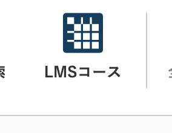
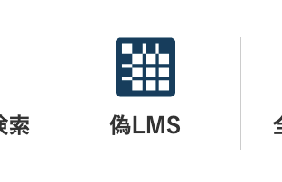

# Good Bye LMS Page

アカンサスポータルのトップからLMSへのリンクがなくなる気がしたので復活させるためのChrome拡張機能です。

## 開発の経緯

2025年5月27日の夕方、製作者が自宅で寝ていたところ、空飛ぶスパゲッティモンスターが夢枕に立って（浮かんで？）、「アカンサスポータルのトップ画面にあるLMSコース一覧へのリンクおよびリンク先ページが、学術メディア創成センターの偉い人マンによって削除されようとしている、これはアカンサスポータル軽量化のため」と告げました。製作者はこのお告げの通りならば金沢大学の学生は大いに苦しむことを予期し、ノアの方舟の如くこの拡張機能を作ったのであります。

## 機能

- アカンサスのLMSリンクからアプリを直接開けるようにパッチ
- 学務情報サービスの時間割からLMSリンクを取得
- LMSリンクをテーブル形式で表示

## インストール方法

1. [リリース](https://github.com/ogawa3427/goodByeLMSPage/releases)から使ってるブラウザの方のパッケージをダウンロード  
(そのうち公式ストアから入れられるようになると思う)

2. Chrome の場合  
[これ](https://qiita.com/Nozomuts/items/fc1d4f8fc995d830817d#:~:text=%E3%81%A7%E3%81%99%EF%BC%81%0A%E3%82%81%E3%81%A3%E3%81%A1%E3%82%83%E7%B0%A1%E5%8D%98-,%E5%8B%95%E4%BD%9C%E7%A2%BA%E8%AA%8D,-chrome%3A//extensions%20%E3%81%AB)参考にして開発者モードonにしてさっきDLしたパッケージを選択

3. Firefoxの場合
[about:debugging#/runtime/this-firefox]の「一時的なアドオンを読み込む」からさっきDLしたパッケージを入れて有効化

4. 学務情報サービスの[履修時間割ページ](https://eduweb.sta.kanazawa-u.ac.jp/Portal/StudentApp/Regist/RegistList.aspx)にアクセス
   - データ取得の確認ダイアログが表示されたら「OK」をクリック
   - 授業情報が自動的に取得・保存されます
   - 進捗はF12->Consoleで見られます
   - はじめに一回やればあとはOK

5. アカンサスのトップページにアクセス
   - LMSリンクが自動的にパッチされ、飛び先が変わって直接開けるようになります


これが

こうなってればいい

6. あとはよしなに

## 注意事項

- データの有効期限は30日間です
- 多数のGETリクエストが発生する場合があります
- この拡張機能は非公式であり、金沢大学とは一切関係ありません

## 開発

```bash
# 依存関係のインストール
npm install

# 開発モードで実行
npm run dev chrome
```

## ビルド

```bash
# Chrome用にビルド
npm run build chrome
```

## ライセンス

MIT
No Warranty!!! 無保証！！！

## Docs

* [webextension-toolbox](https://github.com/HaNdTriX/webextension-toolbox)
* [Deepwiki](https://deepwiki.com/ogawa3427/goodByeLMSPage)


金沢大学のLMS(講義サポートサービス)での各講義ごとのリンクを保持して一覧ページを作成する拡張機能です。
機能は3つ、
1 リンクを公式の見づらいサイトから一覧から取得
2 公式のトップページにリンクを追加
3 リンク先でその保存した一覧を表示
この過程でID/PWや履修講義情報を外部に送信しません。

This is an extension that keeps links for each lecture in Kanazawa University's LMS (Lecture Support Service) and creates a list page.
It has three functions:
1. Get links from the official, hard-to-see site.
2. Add a link to the official top page.
3. Display the saved list at the link destination.
In this process, ID/PW and course registration information are not sent externally.