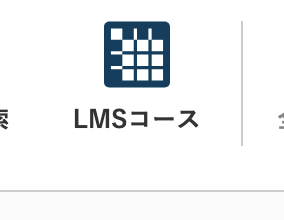

# ハッシュタグ #バイバイ金大LMS 
# Good Bye LMS Page 👋😁 👋😁 👋😁 👋😁 👋😁 👋😁 👋😁 👋😁 👋😁 👋😁 

アカンサスポータルのトップからLMSへのリンクがなくなる気がしたので復活させるためのChrome拡張機能です。😁

## 開発の経緯 👨👋😁 👋😁 👋😁 👋😁 👋😁 

2025年5月27日の夕方、製作者が自宅で寝ていたところ、空飛ぶスパゲッティモンスターが夢枕に立って（浮かんで？）、「アカンサスポータルのトップ画面にあるLMSコース一覧へのリンクおよびリンク先ページが、学術メディア創成センターの偉い人マンによって削除されようとしている、これはアカンサスポータル軽量化のため」と告げました。製作者はこのお告げの通りならば金沢大学の学生は大いに苦しむことを予期し、ノアの方舟の如くこの拡張機能を作ったのであります。👋😁 👋😁 👋😁 👋😁 👋😁  
[2026年春 追記] 当局は本当にLMSページを大改悪しました‼️当局の横暴による喪失の日を、我々自身の手によって我々の精神的勝利の祝祭の日へと変えるのです‼️

## 機能 👋😁👋😁👋😁👋😁👋😁👋😁👋😁 

- アカンサスのLMSリンクからアプリを直接開けるようにパッチ 🔗
- 学務情報サービスの時間割からLMSリンクを取得 📚
- LMSリンクをテーブル形式で表示 📋

## インストール方法 👋😁👋😁👋😁👋😁👋😁👋😁👋😁 

※Chrome 版と Firefox 版がありますが、Chrome 版を強くおすすめしています

1. [リリース](https://github.com/ogawa3427/goodByeLMSPage/releases)からパッケージをダウンロードして解凍する、次のステップではそのフォルダを指定します  

2. Chrome の場合  
アドレスバーに `chrome://extensions` と入力して開き、画面右上の開発者モードをONにしたら左上の「パッケージ化されていない拡張機能を読み込む」をクリック。さっき解凍したフォルダを選択する

3. Firefox の場合  
ストア版がありますが、以下の理由から **Chrome 版を強くおすすめします**:
- [Firefox アドオン版 Good Bye LMS Page](https://addons.mozilla.org/ja/firefox/addon/good-bye-lms-page/) は **ストア審査の関係で Chrome よりバージョン更新が遅れます**  
- ZIP から `about:debugging` → 「一時的なアドオンを読み込む」で入れることもできますが、**Firefox を再起動すると消えます**  

4. 学務情報サービスの[履修時間割ページ](https://eduweb.sta.kanazawa-u.ac.jp/Portal/StudentApp/Regist/RegistList.aspx)にアクセス(リンク先で「履修時間割表」を開く)
   - データ取得の確認ダイアログが表示されるので「YES」をクリック
   - 授業情報が自動的に取得・保存されます
   - 進捗はF12->Consoleで見られます
   - はじめに一回やればあとはOK

5. 拡張機能を開く
   - 👋をクリックするとミニ時間割リンクが出てきます😁


これの中身もいじられています

6. あとはよしなに

<a id="update"></a>
## アップデート方法 👋😁👋😁👋😁👋😁👋😁👋😁👋😁👋😁

1. [リリース](https://github.com/ogawa3427/goodByeLMSPage/releases)から最新版のzipをDLして解凍する
2. 解凍したフォルダの中身を、今インストールされているフォルダに**上書き**する
3. 拡張の管理画面で再読み込み（Chrome: `chrome://extensions` の **更新**、Firefox: 一時アドオンを読み込み直し）

> インストール済みのフォルダをそのまま使い回すのがポイント。新しいフォルダを別途追加すると2つ表示されてしまう。

## 注意事項 👋😁👋😁👋😁👋😁👋😁👋😁 

- 多数のGETリクエストが発生する場合があります
- この拡張機能は非公式であり、金沢大学とは一切関係ありません

## 開発 👋😁👋😁👋😁👋😁👋😁👋😁👋😁👋😁 

```bash
# 依存関係のインストール
npm install
```

## ビルド 👋😁 

```bash
npx wxt build        
```

## ライセンス 👋😁 

MIT
No Warranty!!! 無保証！！！

## Docs 👋😁👋😁👋😁👋😁👋😁👋😁 

* [webextension-toolbox](https://github.com/HaNdTriX/webextension-toolbox)
* [Deepwiki](https://deepwiki.com/ogawa3427/goodByeLMSPage)


金沢大学のLMS(講義サポートサービス)での各講義ごとのリンクを保持して一覧ページを作成する拡張機能です。
機能は3つ、
1 リンクを公式の見づらいサイトから一覧から取得
2 公式のトップページにリンクを追加
3 リンク先でその保存した一覧を表示
この過程でID/PWや履修講義情報を外部に送信しません。

This is an extension that keeps links for each lecture in Kanazawa University's LMS (Lecture Support Service) and creates a list page.
It has three functions:
1. Get links from the official, hard-to-see site.
2. Add a link to the official top page.
3. Display the saved list at the link destination.
In this process, ID/PW and course registration information are not sent externally.

👋😁 👋😁 👋😁 👋😁 👋😁 👋😁 👋😁 👋😁 👋😁 👋😁 👋😁 👋😁 👋😁 👋😁 👋😁 👋😁 